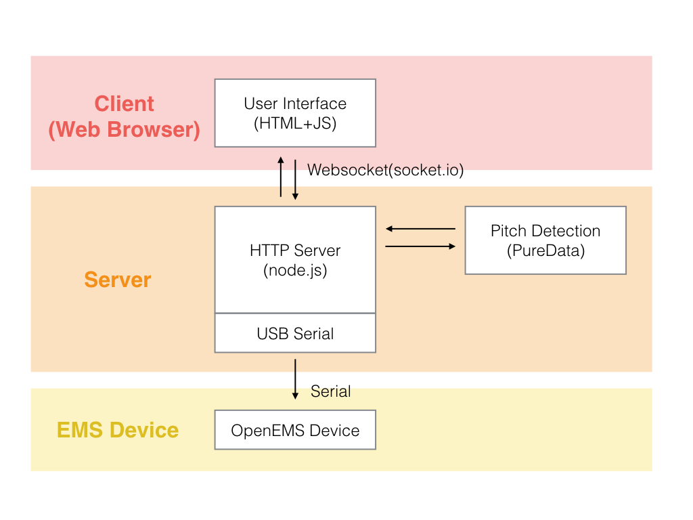
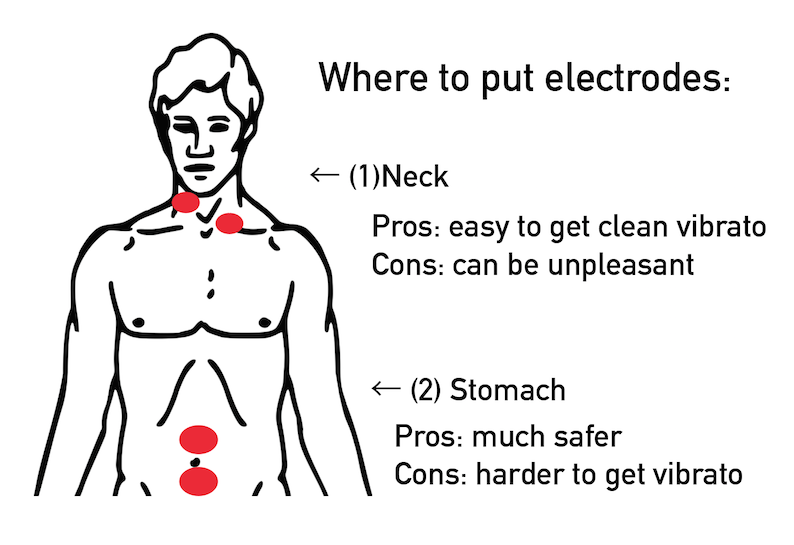

# Vibrat-o-matic

## Architecture

## Dependencies

- node v6.7.0
- npm
 - socket.io@1.4.8
 - express@4.14.0
 - serialport@4.0.3
- jquery
- pressure.js

## How to use

- Vibrat-o-matic works with [openEMSstim](https://github.com/PedroLopes/openEMSstim), open-hardware module to adjust the intensity of EMS/TENS stimulators. Read its instruction to use EMS/TENS safely.

### 0. Install npm dependencies

    cd webapp
    npm install

### 1. Launch HTTP server

Before testing, please make sure *frequency of EMS is set to 5-8 Hz and intensity to minimum.*

    cd webapp
    node index.js [Path to serial port]

Default `[Path to serial port]` is set to `/dev/tty.usbserial-A9O3R1XL`. You can know your path by running `ls /dev/tty.usbserial*` on bash when openEMSstim is connected to your machine via USB.

If web server launched successfully, you will see message like `listening on *:3000`. It means now the process wait for connection from web browser on port 3000. Open `http://localhost:3000` on your browser.

### 2. Put electrodes

Neck and stomach are recommended place to put electrodes. We recommend start with stomach, but you can try both of them. 

See a diagram below: 

### 2. Test the features

On **feature test** section you can test if the system works. 

Then set **duration** to 200ms and **max intensity** to 80%, and increase intensity of your EMS device until you can feel vibration of muscles enough for singing.

If **Repeat** checkbox is checked, the signal will be sent repeadedly.

### 3. Sing!

On **Vibrat-o-matic!** section you can control signal for singing.

Move **Strength** slider for control strength of vibrato. Instead you can drag mouse pointer on **Drag Pad** to control strength.

**Force Detection** Button is for Apple devices which has force detecting trackpad (MacBook 2015, MacBook 2016) or 3D Touch (iPhone 6S, 7). The more strongly you pushed this button, the stronger vibrato you can get.

Below these sections you can see *Song switcher*, **Play** and **Record** buttons and Youtube video. Select a song from a switcher (or push **Select Song** to specify YouTube videoId) and push **Play** to sing on it. **Record** can record the parameters while you controlling vibrato and reproduce them on **Play**. Parameters on each song will shown on **Parameters** section on the left. **Clear** button will clear the parameters of the current song, and **Export** will export all parameters into json file.

### 4. Remote control

If you open port 3000 on your machine (already opened if your firewall is off), you can access the page from other device. You can control vibrato from your smartphone with opening `http://192.168.0.1/remote.html` (192.168.0.1 should be IP address of your machine).

In other word if you open port 3000 publicly, API of your EMS is accessible from your world. Keep a close eye on security!

Enjoy your karaoke time!

## LICENSE

All sources are under MIT license. Music, lyrics are not owned by the authors.

## Authors and contributors

- Ryohei Fushimi (client, server)
- Eisuke Fujinawa (arduino, device, movie)
